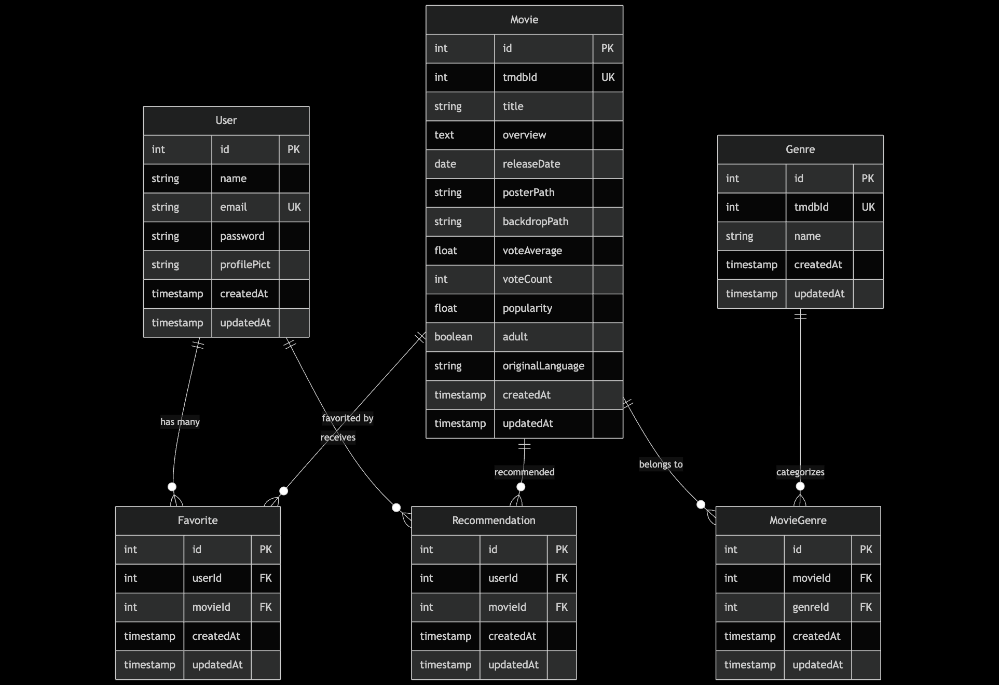
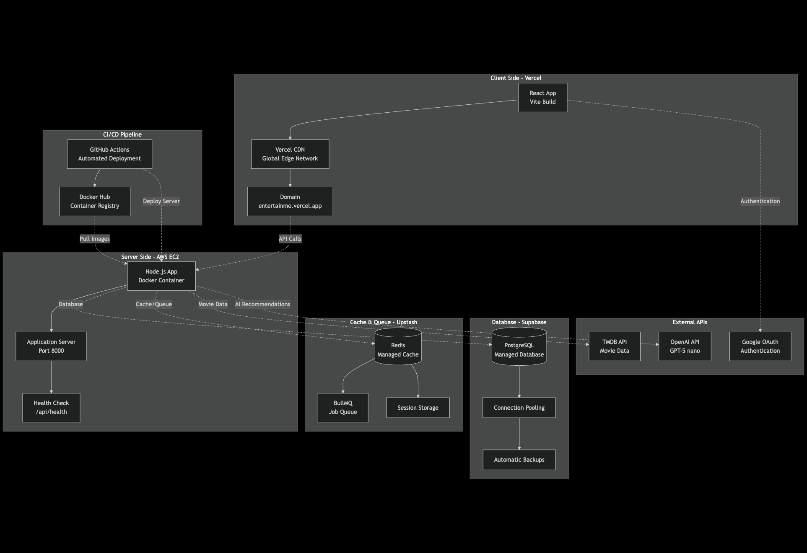
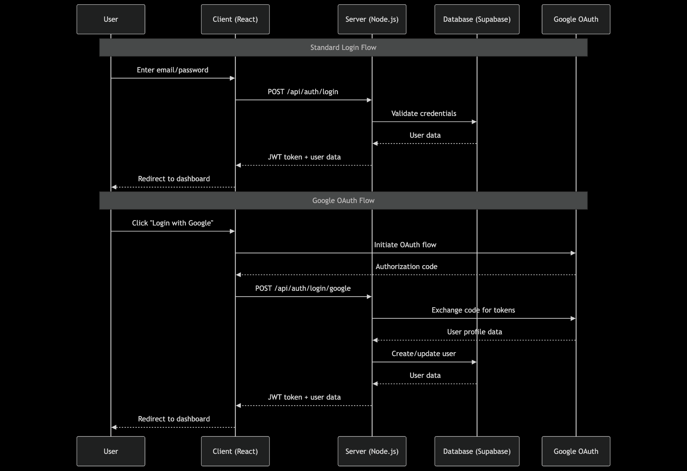
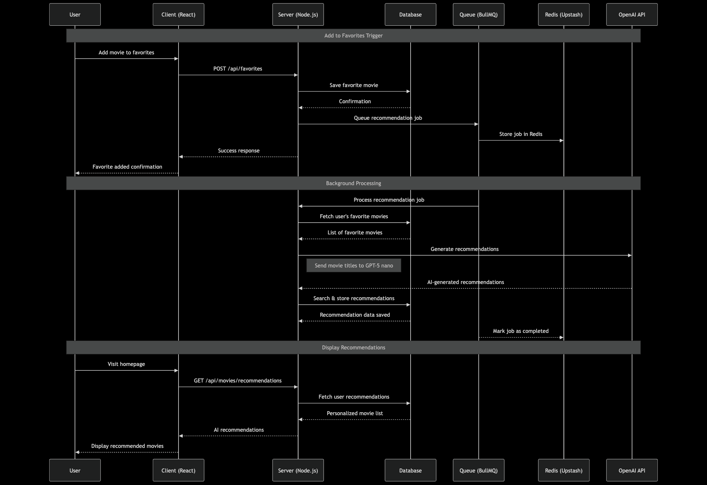

# 🎬 Entertain Me

  
  
  ### Your Gateway to Cinematic Excellence
  
  *Discover, explore, and collect your favorite movies with AI-powered recommendations*
  
  
  
  
  
  

---

## 📋 Table of Contents

- [Product Requirements Document (PRD)](#-product-requirements-document-prd)
- [Software Specification](#-software-specification)
- [Entity Relationship Diagram (ERD)](#-entity-relationship-diagram-erd)
- [Infrastructure Architecture](#-infrastructure-architecture)
- [Sequence Diagrams](#-sequence-diagrams)
- [Tech Stack](#-tech-stack)
- [Getting Started](#-getting-started)
- [Deployment](#-deployment)

## 📄 Product Requirements Document (PRD)

### 🎯 Vision Statement

Entertain Me is a modern movie discovery platform that leverages artificial intelligence to provide personalized movie recommendations, enabling users to explore, discover, and curate their personal movie collections with ease.

### 🎭 Product Overview

**Product Name:** Entertain Me  
**Product Type:** Movie Discovery & Recommendation Platform  
**Target Audience:** Movie enthusiasts, casual viewers, and anyone seeking personalized entertainment  
**Platform:** Web Application (Progressive Web App)

### 🎪 Core Features

#### 1. **Movie Discovery & Browsing**

- **Infinite Scroll Movie Grid**: Seamless browsing experience with lazy loading
- **Category Filtering**: Now Playing, Popular, Top Rated, Upcoming
- **Advanced Search**: Find movies by title, genre, cast, or keywords
- **Movie Details**: Comprehensive information including cast, crew, ratings, trailers

#### 2. **AI-Powered Recommendations**

- **Smart Recommendations**: OpenAI GPT-5 nano powered movie suggestions
- **Personalized Feed**: Recommendations based on user's favorite movies
- **Background Processing**: Queue-based recommendation calculation for optimal performance
- **Learning Algorithm**: Continuously improves based on user interactions

#### 3. **Personal Collection Management**

- **Favorites System**: Save and organize favorite movies
- **Collection Overview**: Visual dashboard of saved movies
- **Quick Actions**: Easy add/remove functionality
- **Collection Insights**: Statistics and genre preferences

#### 4. **User Authentication & Social**

- **Multiple Login Options**: Email/password and Google OAuth
- **User Profiles**: Personalized user experience
- **Secure Sessions**: JWT-based authentication
- **Profile Management**: Update preferences and settings

#### 5. **Enhanced User Experience**

- **Dark/Light Theme**: Customizable interface
- **Responsive Design**: Optimized for all device sizes
- **Progressive Web App**: App-like experience on mobile
- **Fast Loading**: Optimized performance with caching

## 🗄️ Entity Relationship Diagram (ERD)

## 🏗️ Infrastructure Architecture

## 🔄 Sequence Diagrams

### 1. User Authentication Flow

### 2. AI Recommendation Generation Flow

## 🛠️ Tech Stack

### **Frontend Stack**

| Technology    | Purpose          | Version |
| ------------- | ---------------- | ------- |
| React         | UI Framework     | 19.1.1  |
| TypeScript    | Type Safety      | ~5.8.3  |
| Vite          | Build Tool       | ^7.1.2  |
| Tailwind CSS  | Styling          | ^4.1.13 |
| shadcn/ui     | UI Components    | Latest  |
| Redux Toolkit | State Management | ^2.9.0  |
| React Router  | Routing          | ^7.9.1  |
| Axios         | HTTP Client      | ^1.12.2 |

### **Backend Stack**

| Technology | Purpose        | Version |
| ---------- | -------------- | ------- |
| Node.js    | Runtime        | 22.x    |
| Express    | Web Framework  | ^5.1.0  |
| TypeScript | Type Safety    | ^5.9.2  |
| Sequelize  | ORM            | ^6.37.7 |
| PostgreSQL | Database       | 15+     |
| Redis      | Cache/Queue    | 7+      |
| BullMQ     | Queue System   | ^5.58.5 |
| JWT        | Authentication | ^9.0.2  |

### **Infrastructure & Services**

| Service            | Purpose              | Provider       |
| ------------------ | -------------------- | -------------- |
| Frontend Hosting   | React App            | Vercel         |
| Backend Hosting    | Node.js API          | AWS EC2        |
| Database           | PostgreSQL           | Supabase       |
| Cache & Queue      | Redis                | Upstash        |
| Container Registry | Docker Images        | Docker Hub     |
| CI/CD              | Automated Deployment | GitHub Actions |
