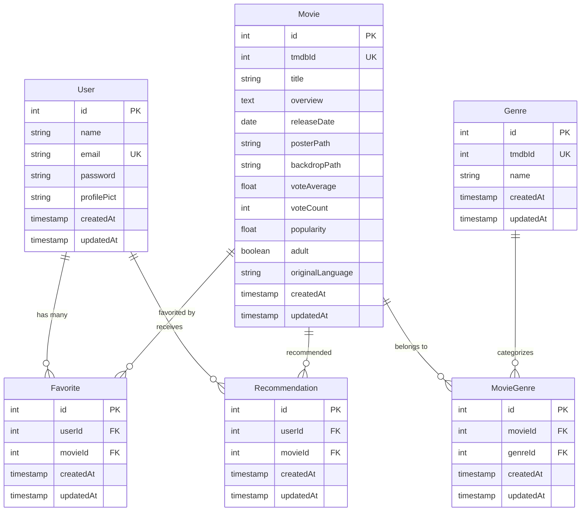
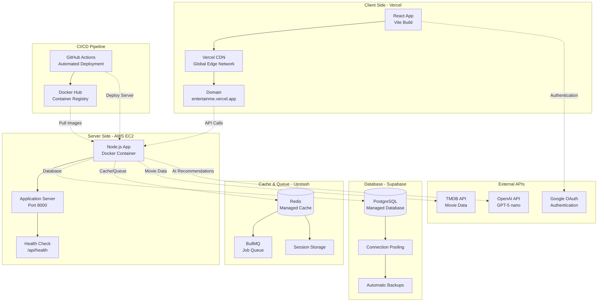
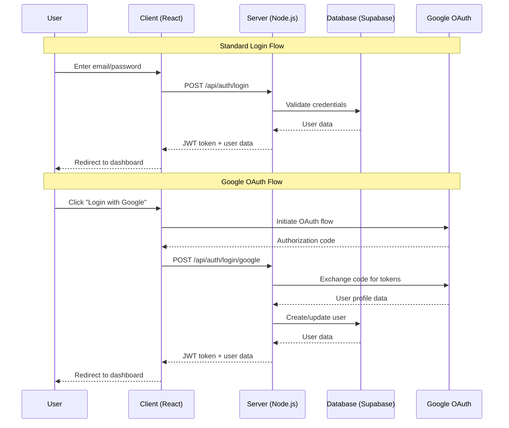
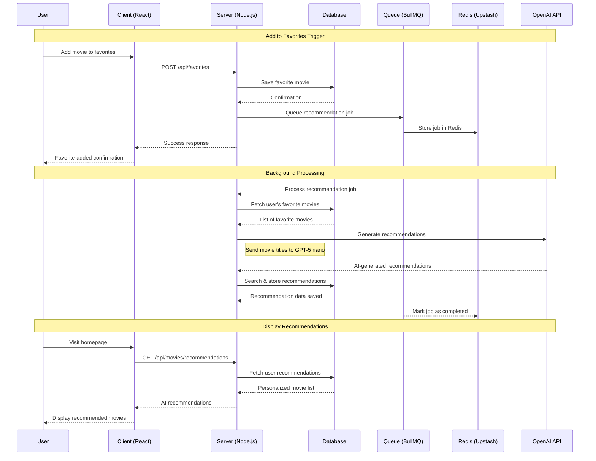

```mermaid
erDiagram
    User {
        int id PK
        string name
        string email UK
        string password
        string profilePict
        timestamp createdAt
        timestamp updatedAt
    }

    Movie {
        int id PK
        int tmdbId UK
        string title
        text overview
        date releaseDate
        string posterPath
        string backdropPath
        float voteAverage
        int voteCount
        float popularity
        boolean adult
        string originalLanguage
        timestamp createdAt
        timestamp updatedAt
    }

    Genre {
        int id PK
        int tmdbId UK
        string name
        timestamp createdAt
        timestamp updatedAt
    }

    Favorite {
        int id PK
        int userId FK
        int movieId FK
        timestamp createdAt
        timestamp updatedAt
    }

    Recommendation {
        int id PK
        int userId FK
        int movieId FK
        timestamp createdAt
        timestamp updatedAt
    }

    MovieGenre {
        int id PK
        int movieId FK
        int genreId FK
        timestamp createdAt
        timestamp updatedAt
    }

    User ||--o{ Favorite : "has many"
    User ||--o{ Recommendation : "receives"
    Movie ||--o{ Favorite : "favorited by"
    Movie ||--o{ Recommendation : "recommended"
    Movie ||--o{ MovieGenre : "belongs to"
    Genre ||--o{ MovieGenre : "categorizes"
```

```mermaid
graph TB
    subgraph "Client Side - Vercel"
        A[React App<br/>Vite Build] --> B[Vercel CDN<br/>Global Edge Network]
        B --> C[Domain<br/>entertainme.vercel.app]
    end

    subgraph "Server Side - AWS EC2"
        D[Node.js App<br/>Docker Container] --> E[Application Server<br/>Port 8000]
        E --> F[Health Check<br/>/api/health]
    end

    subgraph "Database - Supabase"
        G[(PostgreSQL<br/>Managed Database)]
        H[Connection Pooling]
        I[Automatic Backups]
        G --> H
        H --> I
    end

    subgraph "Cache & Queue - Upstash"
        J[(Redis<br/>Managed Cache)]
        K[BullMQ<br/>Job Queue]
        L[Session Storage]
        J --> K
        J --> L
    end

    subgraph "External APIs"
        M[TMDB API<br/>Movie Data]
        N[OpenAI API<br/>GPT-5 nano]
        O[Google OAuth<br/>Authentication]
    end

    subgraph "CI/CD Pipeline"
        P[GitHub Actions<br/>Automated Deployment]
        Q[Docker Hub<br/>Container Registry]
        P --> Q
    end

    C -.->|API Calls| D
    D -.->|Database| G
    D -.->|Cache/Queue| J
    D -.->|Movie Data| M
    D -.->|AI Recommendations| N
    A -.->|Authentication| O
    P -.->|Deploy Server| D
    Q -.->|Pull Images| D
```

### 1. User Authentication Flow

```mermaid
sequenceDiagram
    participant U as User
    participant C as Client (React)
    participant S as Server (Node.js)
    participant DB as Database (Supabase)
    participant G as Google OAuth

    Note over U,G: Standard Login Flow
    U->>C: Enter email/password
    C->>S: POST /api/auth/login
    S->>DB: Validate credentials
    DB-->>S: User data
    S-->>C: JWT token + user data
    C-->>U: Redirect to dashboard

    Note over U,G: Google OAuth Flow
    U->>C: Click "Login with Google"
    C->>G: Initiate OAuth flow
    G-->>C: Authorization code
    C->>S: POST /api/auth/login/google
    S->>G: Exchange code for tokens
    G-->>S: User profile data
    S->>DB: Create/update user
    DB-->>S: User data
    S-->>C: JWT token + user data
    C-->>U: Redirect to dashboard
```

### 2. AI Recommendation Generation Flow

```mermaid
sequenceDiagram
    participant U as User
    participant C as Client (React)
    participant S as Server (Node.js)
    participant DB as Database
    participant Q as Queue (BullMQ)
    participant R as Redis (Upstash)
    participant AI as OpenAI API

    Note over U,AI: Add to Favorites Trigger
    U->>C: Add movie to favorites
    C->>S: POST /api/favorites
    S->>DB: Save favorite movie
    DB-->>S: Confirmation
    S->>Q: Queue recommendation job
    Q->>R: Store job in Redis
    S-->>C: Success response
    C-->>U: Favorite added confirmation

    Note over U,AI: Background Processing
    Q->>S: Process recommendation job
    S->>DB: Fetch user's favorite movies
    DB-->>S: List of favorite movies
    S->>AI: Generate recommendations
    Note right of S: Send movie titles to GPT-5 nano
    AI-->>S: AI-generated recommendations
    S->>DB: Search & store recommendations
    DB-->>S: Recommendation data saved
    Q-->>R: Mark job as completed

    Note over U,AI: Display Recommendations
    U->>C: Visit homepage
    C->>S: GET /api/movies/recommendations
    S->>DB: Fetch user recommendations
    DB-->>S: Personalized movie list
    S-->>C: AI recommendations
    C-->>U: Display recommended movies
```